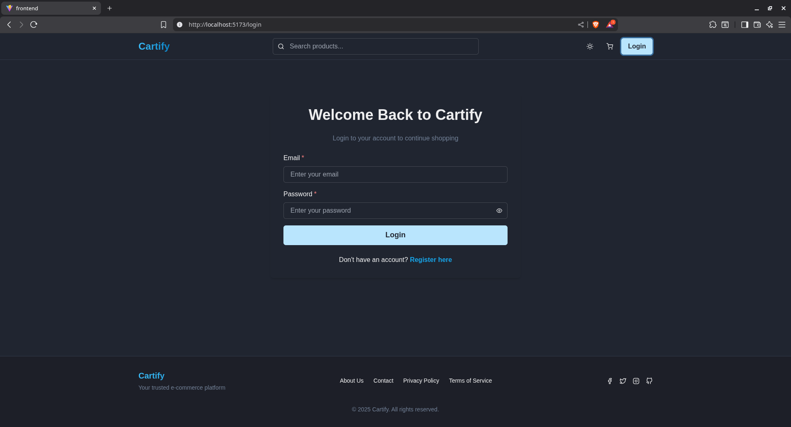
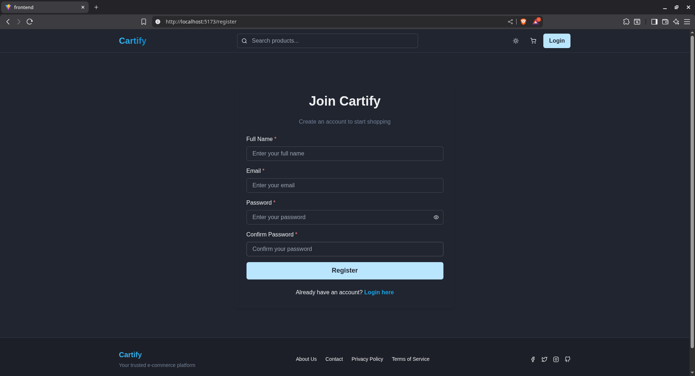
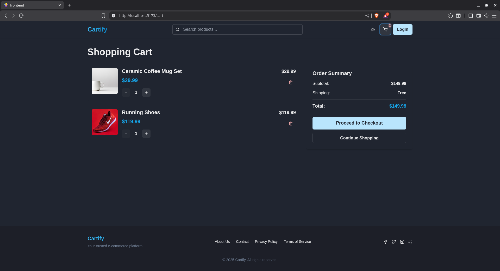

# Cartify - Modern E-Commerce Platform

A full-stack MERN e-commerce platform with real-time updates via Socket.io, featuring product management, shopping cart, checkout, and admin dashboard.

## 🚀 Features

### Customer Features
- 🛍️ Product catalog with search, filters, and pagination
- 🔍 Product detail pages with variants
- 🛒 Shopping cart with localStorage persistence
- 💳 Checkout with shipping information
- 👤 User authentication (register/login)
- 📦 Order history with real-time status updates
- 🌙 Dark mode support

### Admin Features
- 📊 Admin dashboard
- ➕ Create, update, and delete products
- 📋 Manage orders and update status
- 📈 Real-time order notifications
- 📦 Stock management with live updates

### Technical Features
- ⚡ Real-time updates using Socket.io
- 🎨 Modern UI with Tailwind CSS and Chakra UI
- 🔐 JWT-based authentication
- 📱 Fully responsive design
- 🌐 RESTful API
- 🔄 Redux Toolkit for state management

## � Screenshots

### Home Page


### Product Catalog


### Product Detail


### Shopping Cart


### Checkout


### User Profile


### Order History


### Admin Dashboard - Products


### Admin Dashboard - Orders


### Responsive Design


## �🛠️ Tech Stack

### Frontend
- React 19
- Vite
- Redux Toolkit
- React Router v7
- Tailwind CSS
- Chakra UI
- Axios
- Socket.io-client

### Backend
- Node.js
- Express.js
- MongoDB with Mongoose
- Socket.io
- JWT for authentication
- Bcrypt for password hashing

## 📦 Installation

### Prerequisites
- Node.js (v16 or higher)
- MongoDB (local or Atlas)
- npm or yarn

### Setup Instructions

1. **Clone the repository**
   ```bash
   git clone <your-repo-url>
   cd finalproject
   ```

2. **Install dependencies**
   ```bash
   npm run install-all
   ```

3. **Configure environment variables**
   
   Create a `.env` file in the root directory:
   ```env
   MONGO_URI=your_mongodb_connection_string
   JWT_SECRET=your_jwt_secret_key
   PORT=5000
   NODE_ENV=development
   CLIENT_URL=http://localhost:5173
   ```

   Create a `.env` file in the `frontend` directory:
   ```env
   VITE_API_BASE_URL=http://localhost:5000/api
   ```

4. **Run the application**
   
   Development mode (runs both frontend and backend):
   ```bash
   npm run dev
   ```

   Or run separately:
   ```bash
   # Backend only
   npm run server

   # Frontend only  
   npm run client
   ```

5. **Access the application**
   - Frontend: http://localhost:5173
   - Backend API: http://localhost:5000/api

## 👤 Creating an Admin User

To create an admin user, you can:

1. Register a normal user through the UI
2. Manually update the user's role in MongoDB:
   ```javascript
   db.users.updateOne(
     { email: "admin@example.com" },
     { $set: { role: "admin" } }
   )
   ```

Or create an admin user directly in MongoDB:
```javascript
db.users.insertOne({
  name: "Admin",
  email: "admin@cartify.com",
  password: "$2a$12$hashedPasswordHere",
  role: "admin",
  createdAt: new Date(),
  updatedAt: new Date()
})
```

## 📁 Project Structure

```
finalproject/
├── backend/
│   ├── config/
│   │   └── db.js
│   ├── controllers/
│   │   ├── auth.controller.js
│   │   ├── order.controller.js
│   │   └── product.controller.js
│   ├── middleware/
│   │   └── auth.middleware.js
│   ├── models/
│   │   ├── order.model.js
│   │   ├── product.model.js
│   │   └── user.model.js
│   ├── routes/
│   │   ├── auth.route.js
│   │   ├── order.route.js
│   │   └── product.route.js
│   └── server.js
├── frontend/
│   ├── public/
│   ├── src/
│   │   ├── api/
│   │   │   ├── apiClient.js
│   │   │   └── socket.js
│   │   ├── components/
│   │   │   ├── Footer.jsx
│   │   │   ├── Loader.jsx
│   │   │   ├── Navbar.jsx
│   │   │   ├── ProductCard.jsx
│   │   │   └── ProtectedRoute.jsx
│   │   ├── pages/
│   │   │   ├── AdminOrdersPage.jsx
│   │   │   ├── AdminProductsPage.jsx
│   │   │   ├── CartPage.jsx
│   │   │   ├── CheckoutPage.jsx
│   │   │   ├── HomePage.jsx
│   │   │   ├── LoginPage.jsx
│   │   │   ├── ProductDetailPage.jsx
│   │   │   ├── ProfilePage.jsx
│   │   │   └── RegisterPage.jsx
│   │   ├── store/
│   │   │   ├── authSlice.js
│   │   │   ├── cartSlice.js
│   │   │   ├── ordersSlice.js
│   │   │   ├── productsSlice.js
│   │   │   └── index.js
│   │   ├── utils/
│   │   │   ├── auth.js
│   │   │   └── cart.js
│   │   ├── App.jsx
│   │   ├── main.jsx
│   │   └── index.css
│   ├── .env
│   ├── package.json
│   ├── tailwind.config.js
│   └── vite.config.js
├── .env
├── package.json
└── README.md
```

## 🔑 API Endpoints

### Authentication
- `POST /api/auth/register` - Register new user
- `POST /api/auth/login` - Login user
- `GET /api/auth/profile` - Get user profile (protected)
- `PUT /api/auth/profile` - Update user profile (protected)

### Products
- `GET /api/products` - Get all products (with filters)
- `GET /api/products/:id` - Get single product
- `POST /api/products` - Create product (admin only)
- `PUT /api/products/:id` - Update product (admin only)
- `DELETE /api/products/:id` - Delete product (admin only)

### Orders
- `POST /api/orders` - Create order (protected)
- `GET /api/orders` - Get user orders (protected)
- `GET /api/orders/:id` - Get single order (protected)
- `GET /api/orders/admin/all` - Get all orders (admin only)
- `PUT /api/orders/:id/status` - Update order status (admin only)

## 🌐 Socket.io Events

### Client to Server
- `connection` - Establish socket connection
- `disconnect` - Close socket connection

### Server to Client
- `productCreated` - New product created
- `stockUpdated` - Product stock updated
- `newOrder` - New order placed
- `orderStatusUpdated` - Order status changed

## 🎨 UI Features

- Responsive design for all screen sizes
- Dark/Light mode toggle
- Smooth animations and transitions
- Toast notifications for user feedback
- Loading states and error handling
- Form validation

## 🔒 Security Features

- Password hashing with bcrypt
- JWT token authentication
- Protected routes
- Admin role-based access control
- Input validation and sanitization

## 📝 Environment Variables

### Backend (.env)
```env
MONGO_URI=mongodb://localhost:27017/cartify
JWT_SECRET=your_super_secret_jwt_key
PORT=5000
NODE_ENV=development
CLIENT_URL=http://localhost:5173
```

### Frontend (frontend/.env)
```env
VITE_API_BASE_URL=http://localhost:5000/api
```

## 🚀 Deployment

This application is ready for deployment on **Render** (both frontend and backend):
- **Backend**: Render Web Service (Node.js/Express API)
- **Frontend**: Render Static Site (React/Vite)

### 📚 Deployment Guide

For detailed step-by-step deployment instructions, see **[DEPLOYMENT.md](DEPLOYMENT.md)**

### Quick Deployment Steps

1. **Deploy Both Services Using Render Blueprint**
   - Push code to GitHub
   - Go to Render Dashboard → New Blueprint
   - Connect repository
   - Render detects `render.yaml` and creates both services
   - Configure environment variables for both services
   - Deploy (both services deploy together)

2. **Set Environment Variables**
   - **Backend**: `MONGO_URI`, `JWT_SECRET`, `CLIENT_URL`
   - **Frontend**: `VITE_API_BASE_URL`

3. **Verify Deployment**
   - Backend: `https://cartify-backend.onrender.com`
   - Frontend: `https://cartify-frontend.onrender.com`

### Environment Variables Reference

See **[ENV_VARIABLES.md](ENV_VARIABLES.md)** for complete environment variables setup.

### Production Build (Local Testing)
```bash
npm run build
npm start
```

The build command will:
1. Install all dependencies
2. Build the frontend
3. Serve static files from backend

## 🤝 Contributing

Contributions are welcome! Please feel free to submit a Pull Request.

## 📄 License

This project is licensed under the ISC License.

## 👨‍💻 Author

Victor

## 🙏 Acknowledgments

- React Team for React
- Chakra UI for the component library
- Tailwind CSS for utility-first CSS
- MongoDB for the database
- Socket.io for real-time functionality

---

**Happy Shopping! 🛒**
