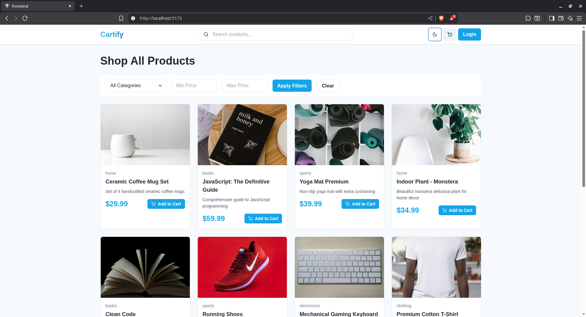
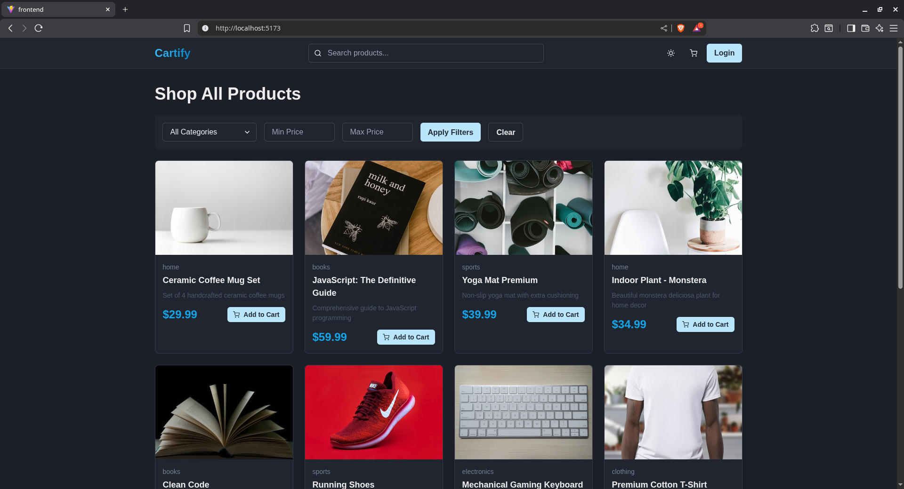
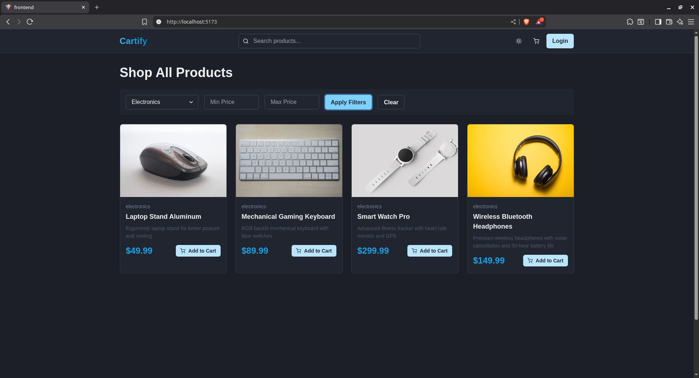
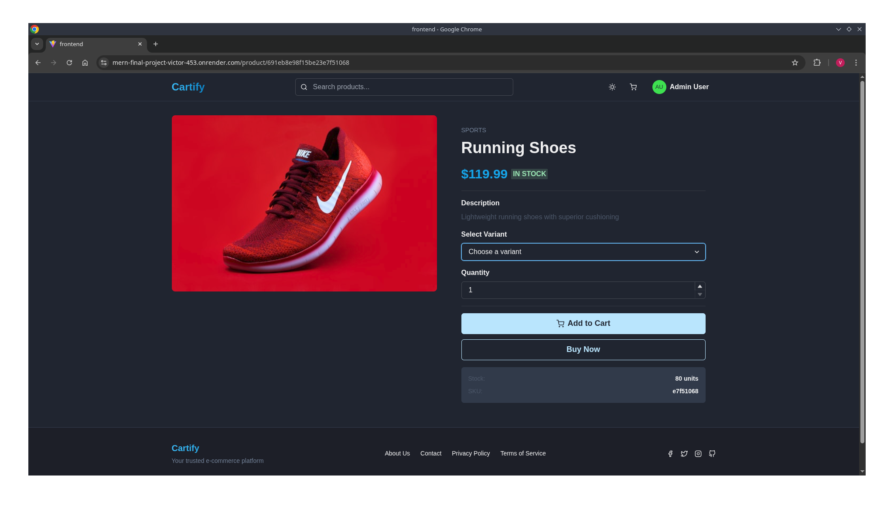
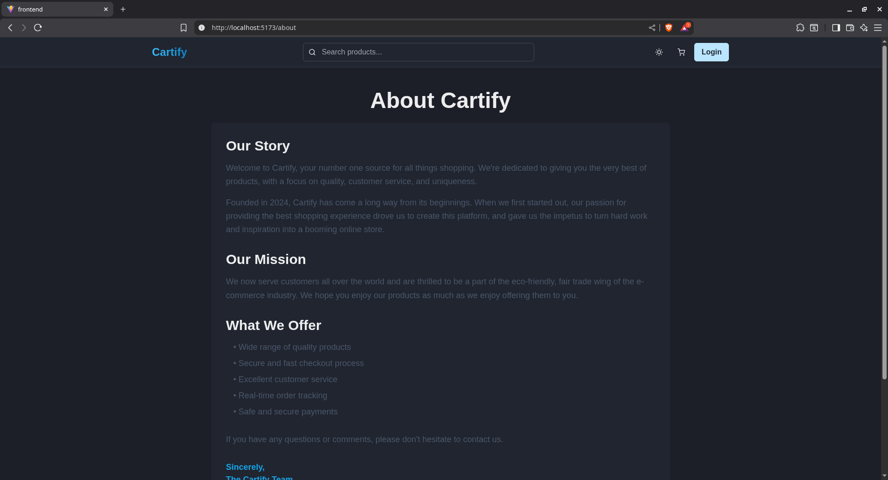
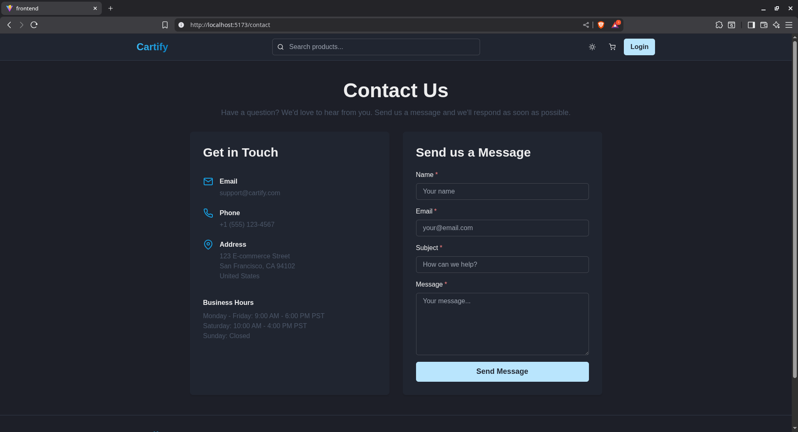
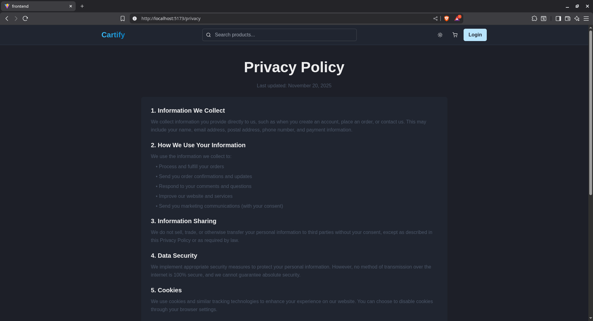
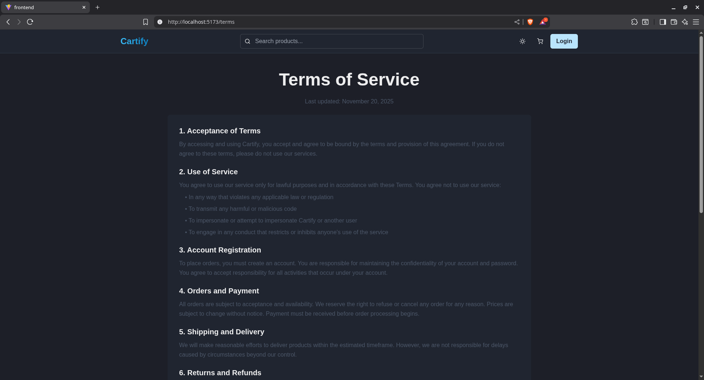

# Cartify - Modern E-Commerce Platform

A full-stack MERN e-commerce platform with real-time updates via Socket.io, featuring product management, shopping cart, checkout, and admin dashboard.

## 🌐 Live Demo

**Live Application:** [https://mern-final-project-victor-453.onrender.com/](https://mern-final-project-victor-453.onrender.com/)

### Test Credentials
- **Admin Account:**
  - Email: `admin@cartify.com`
  - Password: `admin123`
- **Regular User Account:**
  - Email: `user@cartify.com`
  - Password: `user123`

## 🚀 Features

### Customer Features
- 🛍️ Product catalog with search, filters, and pagination
- 🔍 Product detail pages with variants
- 🛒 Shopping cart with localStorage persistence
- 💳 Checkout with shipping information
- 👤 User authentication (register/login)
- 📦 Order history with real-time status updates
- 🌙 Dark mode support

### Admin Features
- 📊 Admin dashboard
- ➕ Create, update, and delete products
- 📋 Manage orders and update status
- 📈 Real-time order notifications
- 📦 Stock management with live updates

### Technical Features
- ⚡ Real-time updates using Socket.io
- 🎨 Modern UI with Tailwind CSS and Chakra UI
- 🔐 JWT-based authentication
- 📱 Fully responsive design
- 🌐 RESTful API
- 🔄 Redux Toolkit for state management

## 📸 Screenshots

### Home Page (Light Mode)


### Home Page (Dark Mode)


### Product Filters


### Product Detail Page


### Shopping Cart


### User Registration


### User Login


### About Page


### Contact Page


### Privacy Policy


### Terms of Service


## �🛠️ Tech Stack

### Frontend
- React 19
- Vite
- Redux Toolkit
- React Router v7
- Tailwind CSS
- Chakra UI
- Axios
- Socket.io-client

### Backend
- Node.js
- Express.js
- MongoDB with Mongoose
- Socket.io
- JWT for authentication
- Bcrypt for password hashing

## 📦 Installation

### Prerequisites
- Node.js (v16 or higher)
- MongoDB (local or Atlas)
- npm or yarn

### Setup Instructions

1. **Clone the repository**
   ```bash
   git clone <your-repo-url>
   cd finalproject
   ```

2. **Install dependencies**
   ```bash
   npm run install-all
   ```

3. **Configure environment variables**
   
   Create a `.env` file in the root directory:
   ```env
   MONGO_URI=your_mongodb_connection_string
   JWT_SECRET=your_jwt_secret_key
   PORT=5000
   NODE_ENV=development
   CLIENT_URL=http://localhost:5173
   ```

   Create a `.env` file in the `frontend` directory:
   ```env
   VITE_API_BASE_URL=http://localhost:5000/api
   ```

4. **Run the application**
   
   Development mode (runs both frontend and backend):
   ```bash
   npm run dev
   ```

   Or run separately:
   ```bash
   # Backend only
   npm run server

   # Frontend only  
   npm run client
   ```

5. **Access the application**
   - Frontend: http://localhost:5173
   - Backend API: http://localhost:5000/api

## 👤 Creating an Admin User

To create an admin user, you can:

1. Register a normal user through the UI
2. Manually update the user's role in MongoDB:
   ```javascript
   db.users.updateOne(
     { email: "admin@example.com" },
     { $set: { role: "admin" } }
   )
   ```

Or create an admin user directly in MongoDB:
```javascript
db.users.insertOne({
  name: "Admin",
  email: "admin@cartify.com",
  password: "$2a$12$hashedPasswordHere",
  role: "admin",
  createdAt: new Date(),
  updatedAt: new Date()
})
```

## 📁 Project Structure

```
finalproject/
├── backend/
│   ├── config/
│   │   └── db.js
│   ├── controllers/
│   │   ├── auth.controller.js
│   │   ├── order.controller.js
│   │   └── product.controller.js
│   ├── middleware/
│   │   └── auth.middleware.js
│   ├── models/
│   │   ├── order.model.js
│   │   ├── product.model.js
│   │   └── user.model.js
│   ├── routes/
│   │   ├── auth.route.js
│   │   ├── order.route.js
│   │   └── product.route.js
│   └── server.js
├── frontend/
│   ├── public/
│   ├── src/
│   │   ├── api/
│   │   │   ├── apiClient.js
│   │   │   └── socket.js
│   │   ├── components/
│   │   │   ├── Footer.jsx
│   │   │   ├── Loader.jsx
│   │   │   ├── Navbar.jsx
│   │   │   ├── ProductCard.jsx
│   │   │   └── ProtectedRoute.jsx
│   │   ├── pages/
│   │   │   ├── AdminOrdersPage.jsx
│   │   │   ├── AdminProductsPage.jsx
│   │   │   ├── CartPage.jsx
│   │   │   ├── CheckoutPage.jsx
│   │   │   ├── HomePage.jsx
│   │   │   ├── LoginPage.jsx
│   │   │   ├── ProductDetailPage.jsx
│   │   │   ├── ProfilePage.jsx
│   │   │   └── RegisterPage.jsx
│   │   ├── store/
│   │   │   ├── authSlice.js
│   │   │   ├── cartSlice.js
│   │   │   ├── ordersSlice.js
│   │   │   ├── productsSlice.js
│   │   │   └── index.js
│   │   ├── utils/
│   │   │   ├── auth.js
│   │   │   └── cart.js
│   │   ├── App.jsx
│   │   ├── main.jsx
│   │   └── index.css
│   ├── .env
│   ├── package.json
│   ├── tailwind.config.js
│   └── vite.config.js
├── .env
├── package.json
└── README.md
```

## 🔑 API Endpoints

### Authentication
- `POST /api/auth/register` - Register new user
- `POST /api/auth/login` - Login user
- `GET /api/auth/profile` - Get user profile (protected)
- `PUT /api/auth/profile` - Update user profile (protected)

### Products
- `GET /api/products` - Get all products (with filters)
- `GET /api/products/:id` - Get single product
- `POST /api/products` - Create product (admin only)
- `PUT /api/products/:id` - Update product (admin only)
- `DELETE /api/products/:id` - Delete product (admin only)

### Orders
- `POST /api/orders` - Create order (protected)
- `GET /api/orders` - Get user orders (protected)
- `GET /api/orders/:id` - Get single order (protected)
- `GET /api/orders/admin/all` - Get all orders (admin only)
- `PUT /api/orders/:id/status` - Update order status (admin only)

## 🌐 Socket.io Events

### Client to Server
- `connection` - Establish socket connection
- `disconnect` - Close socket connection

### Server to Client
- `productCreated` - New product created
- `stockUpdated` - Product stock updated
- `newOrder` - New order placed
- `orderStatusUpdated` - Order status changed

## 🎨 UI Features

- Responsive design for all screen sizes
- Dark/Light mode toggle
- Smooth animations and transitions
- Toast notifications for user feedback
- Loading states and error handling
- Form validation

## 🔒 Security Features

- Password hashing with bcrypt
- JWT token authentication
- Protected routes
- Admin role-based access control
- Input validation and sanitization

## 📝 Environment Variables

### Backend (.env)
```env
MONGO_URI=mongodb://localhost:27017/cartify
JWT_SECRET=your_super_secret_jwt_key
PORT=5000
NODE_ENV=development
CLIENT_URL=http://localhost:5173
```

### Frontend (frontend/.env)
```env
VITE_API_BASE_URL=http://localhost:5000/api
```

## 🚀 Deployment

This application is deployed as a **unified single-server deployment** on Render, where the Express backend serves the production React build.

### Deployment Architecture
- **Single Web Service**: Backend serves both API and frontend static files
- **Platform**: Render.com
- **Build Process**: Automated with smart database seeding
- **Database**: MongoDB Atlas

### Quick Deployment Steps

1. **Push to GitHub**
   ```bash
   git add .
   git commit -m "Deploy to Render"
   git push
   ```

2. **Create Render Web Service**
   - Go to [Render Dashboard](https://dashboard.render.com)
   - Click "New +" → "Web Service"
   - Connect your GitHub repository
   - Configure:
     - **Build Command**: `npm run build`
     - **Start Command**: `npm start`

3. **Set Environment Variables** (in Render dashboard)
   ```
   MONGO_URI=your_mongodb_atlas_connection_string
   JWT_SECRET=your_jwt_secret_key
   PORT=5000
   NODE_ENV=production
   CLIENT_URL=https://your-app.onrender.com
   ```

4. **Deploy** - Render will automatically:
   - Install dependencies (backend & frontend)
   - Build frontend production bundle
   - Seed database if empty (automatic on first deployment)
   - Start the server

### Production Build (Local Testing)
```bash
npm run build
npm start
```

The build command will:
1. Install backend dependencies
2. Install frontend dependencies
3. Build the frontend (creates `frontend/dist`)
4. Run smart seeding (only if database is empty)

The start command serves the Express API and static frontend files.

## 🔄 Recent Changes & Updates

### Deployment Configuration (November 2025)
- ✅ **Unified Deployment**: Configured for single-server deployment (backend serves frontend)
- ✅ **Express v5 Compatibility**: Updated route handling for Express v5's new path-to-regexp
- ✅ **Smart Auto-Seeding**: Database automatically seeds on first deployment only
- ✅ **Production API Fixes**: Fixed API client to use relative paths in production
- ✅ **Socket.io Production**: Configured Socket.io for same-origin in production
- ✅ **Removed Old Configs**: Cleaned up unused deployment files (render.yaml, vercel.json)

### Package.json Scripts
```json
{
  "build": "Install all deps + build frontend + smart seed",
  "start": "Start production server",
  "dev": "Run backend & frontend concurrently",
  "seed": "Manual seed (clears data)",
  "seed:auto": "Smart seed (only if empty)"
}
```

### Key Features Added
- Automatic database seeding on initial deployment
- Production-optimized API configuration
- Express v5 middleware-based SPA routing
- Environment-aware API client (dev vs production)

## 🤝 Contributing

Contributions are welcome! Please feel free to submit a Pull Request.

## 📄 License

This project is licensed under the ISC License.

## 👨‍💻 Author

Victor

## 🙏 Acknowledgments

- React Team for React
- Chakra UI for the component library
- Tailwind CSS for utility-first CSS
- MongoDB for the database
- Socket.io for real-time functionality

---

**Happy Shopping! 🛒**
